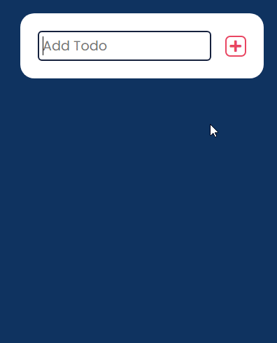

# React Ts Todo list with slide drop

### *Little projet i did few months ago to practice TypeScript on a React project. The most interesting part was to investigate how to make the slide and drop feature without using external library*

## Functionalities :

- Add a todo
- Delete a todo
- Todos are saved on page refresh (local storage)
- Reorder todos by using mouse slide and drop

